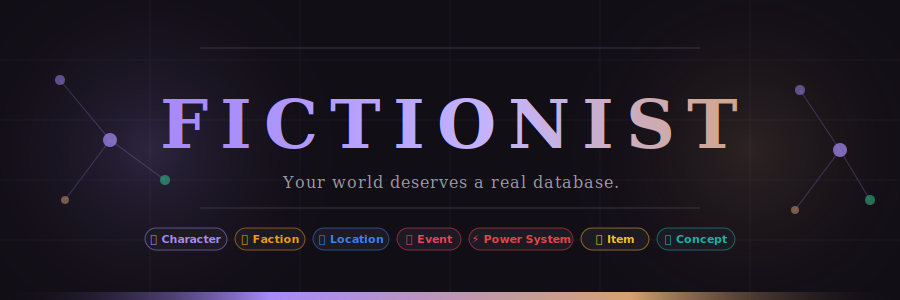
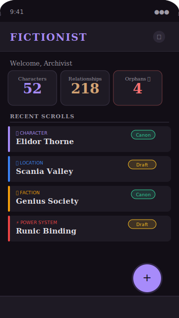
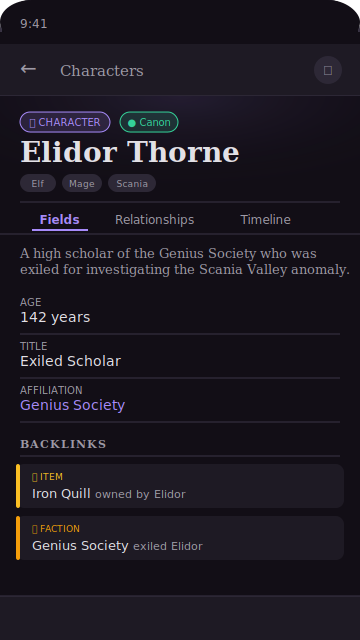
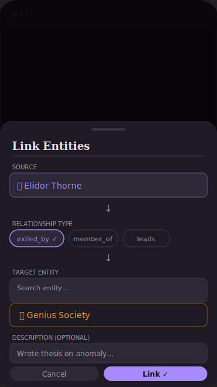

<div align="center">



<br/>

[](https://flutter.dev)
[](https://dart.dev)
[](https://www.android.com)
[](https://www.sqlite.org)
[](LICENSE)
[]()
[](CONTRIBUTING.md)
[]()

<br/>

*An offline-first mobile knowledge graph for fiction writers —*
*built for the worlds too complex to fit in notes.*

<br/>

**[Overview](#-overview) · [Features](#-features) · [Screenshots](#-screenshots) · [Quick Start](#-quick-start) · [Architecture](#-architecture) · [Roadmap](#-roadmap) · [Docs](#-documentation)**

</div>

---

## 🌌 Overview

Complex fantasy worldbuilding outgrows flat notes fast. A single epic fantasy novel can spawn hundreds of characters, dozens of factions, layered magic systems, branching timelines, and intricate location hierarchies — all deeply interconnected.

**Fictionist** treats your world the way it actually works: as a graph of typed entities and semantic relationships. A character isn't a page of markdown — it's a structured object connected to factions, locations, and events through bidirectional, queryable links.

> *Built to solve a real problem. A fullstack engineer writing an epic fantasy novel, frustrated by every existing tool.*

<br/>

<table>
<tr>
<td width="25%" align="center">
<br/>
<sub>Great for docs, <strong>terrible</strong> for relationships</sub>
</td>
<td width="25%" align="center">
<br/>
<sub>Mobile is an afterthought; graph view is a hairball at scale</sub>
</td>
<td width="25%" align="center">
<br/>
<sub>Web-only, subscription-gated, designed for TTRPG</sub>
</td>
<td width="25%" align="center">
<br/>
<sub>Shallow relationships, desktop-first, no typed links</sub>
</td>
</tr>
</table>

<div align="center">

**None of them are simultaneously offline-first, mobile-native, and relationship-centric.**
Fictionist fills that gap.

</div>

---

## 📸 Screenshots

<div align="center">

<table>
<tr>
<td align="center" width="33%">
<br/>
<sub><b>Dashboard</b><br/>Your world at a glance</sub>
</td>
<td align="center" width="33%">
<br/>
<sub><b>Entity Detail</b><br/>The Codex Page</sub>
</td>
<td align="center" width="33%">
<br/>
<sub><b>Relationship Linker</b><br/>Typed, semantic connections</sub>
</td>
</tr>
</table>

</div>

---

## ✨ Features

### 🗂 Eight Pre-Typed Entity Classes

<div align="center">

<table>
<tr>
<td align="center" width="12.5%">
<br/>
<b>Character</b><br/><sub>People & creatures</sub>
</td>
<td align="center" width="12.5%">
<br/>
<b>Faction</b><br/><sub>Orgs & guilds</sub>
</td>
<td align="center" width="12.5%">
<br/>
<b>Race / Culture</b><br/><sub>Species & ethnicity</sub>
</td>
<td align="center" width="12.5%">
<br/>
<b>Location</b><br/><sub>Places & planes</sub>
</td>
<td align="center" width="12.5%">
<br/>
<b>Power System</b><br/><sub>Magic & tech</sub>
</td>
<td align="center" width="12.5%">
<br/>
<b>Item / Artifact</b><br/><sub>Relics & weapons</sub>
</td>
<td align="center" width="12.5%">
<br/>
<b>Event</b><br/><sub>Battles & rites</sub>
</td>
<td align="center" width="12.5%">
<br/>
<b>Concept</b><br/><sub>Lore & glossary</sub>
</td>
</tr>
</table>

</div>

Each type ships with **sensible default fields** and its own **accent color** in the UI. No blank-slate syndrome.

---

### 🔗 Typed, Bidirectional Relationships

The core differentiator. Every link between entities carries a **semantic type label** — not just a markdown `[[link]]`.

```
Kael ──[leads]──────────────────► Iron Pact
Iron Pact ──[is led by]─────────► Kael   ← auto-suggested reciprocal
```

<table>
<tr><td>✅ Create a link in one direction → Fictionist suggests the reciprocal</td></tr>
<tr><td>✅ Query all relationships from either side, always</td></tr>
<tr><td>✅ Backlinks surface on every entity detail page automatically</td></tr>
<tr><td>✅ Orphan detection flags entities with zero connections</td></tr>
</table>

---

### 🔍 Instant Full-Text Search

Powered by **SQLite FTS5** — searches across entity names, descriptions, and all custom field values.

<div align="center">

| Metric | Target | Notes |
|--------|--------|-------|
| ⌨️ Search results | **< 300ms** | Debounced at 250ms |
| 📋 Entity list (1,000+) | **< 500ms** | Screen entry to full render |
| 📄 Detail page load | **< 200ms** | Including all relationships |
| 🚀 Cold start | **< 3s** | Mid-range Android (Snapdragon 6-series) |
| 💾 Max scale | **5,000+ entities** | With full custom fields |

</div>

**Quick-switcher overlay** (think `Cmd+K`) — jump to any entity by typing a few characters.

---

### 📅 Timeline & Specialized Views

<table>
<tr>
<td width="40">📅</td>
<td><b>Timeline View</b> — chronological event track with manual ordering and era grouping</td>
<td align="right"><code>Phase 1 ✅</code></td>
</tr>
<tr>
<td>🕸</td>
<td><b>Graph View</b> — interactive force-directed graph, filterable by entity type and relationship label</td>
<td align="right"><code>Phase 2 ✅</code></td>
</tr>
<tr>
<td>🌳</td>
<td><b>Family Tree</b> — hierarchical character relationship visualization</td>
<td align="right"><code>Phase 2 ✅</code></td>
</tr>
<tr>
<td>🗺</td>
<td><b>World Map</b> — pin entities to a user-uploaded image canvas with glowing pulses & bottom preview cards</td>
<td align="right"><code>Phase 3 ✅</code></td>
</tr>
</table>

---

### ⚡ Everything Else

<table>
<tr>
<td>⚡ <b>Quick Capture</b></td>
<td>FAB → name + type → saved in <b>under 5 seconds</b></td>
</tr>
<tr>
<td>🧩 <b>Custom Fields</b></td>
<td>Add typed fields (text, number, date, select) to any entity</td>
</tr>
<tr>
<td>📋 <b>Templates</b></td>
<td>Save entity structures as reusable templates</td>
</tr>
<tr>
<td>🏷 <b>Tags</b></td>
<td>Freeform cross-cutting labels — <code>book-1</code>, <code>antagonist</code>, <code>needs-revision</code></td>
</tr>
<tr>
<td>🔄 <b>Status Workflow</b></td>
<td>Draft → Canon → Archived → Deprecated per entity</td>
</tr>
<tr>
<td>📊 <b>World Stats</b></td>
<td>Entity counts, relationship density, most-connected nodes</td>
</tr>
<tr>
<td>📦 <b>JSON Export</b></td>
<td>Full world export, always free, always local — no "subscribe to export"</td>
</tr>
<tr>
<td>📜 <b>Version History</b> <i>(Phase 2)</i></td>
<td>Per-entity edit history with diff view and restore</td>
</tr>
</table>

---

## 🆚 Why Not Just Use...

<div align="center">

| | **Fictionist** | Notion | Obsidian | World Anvil | Campfire | LegendKeeper |
|--|:-----------:|:------:|:--------:|:-----------:|:--------:|:------------:|
| Full offline (zero network) | ✅ | ⚠️ partial | ✅ | ❌ | ⚠️ desktop | ❌ |
| Mobile-native | ✅ | ⚠️ | ⚠️ sluggish | ❌ | ❌ | ❌ |
| Typed relationships | ✅ | ❌ | ❌ | ⚠️ | ⚠️ shallow | ❌ |
| Reciprocal auto-suggest | ✅ | ❌ | ❌ | ❌ | ❌ | ❌ |
| Pre-defined entity types | ✅ 8 types | ❌ | ❌ | ✅ many | ✅ modules | ⚠️ generic |
| Specialized views | ✅ | ❌ | ⚠️ | ✅ TTRPG | ⚠️ | ✅ maps |
| JSON export (always free) | ✅ | ⚠️ | ✅ | ⚠️ paid | ⚠️ | ⚠️ |
| **Price** | **🆓 Free** | $8–10/mo | Free + sync $4/mo | $5–13/mo | $44.95 | $9/mo |

</div>

> **Why not Obsidian?** It's the closest competitor. But every note is equal — a character and a location are the same markdown file. Relationships are untyped `[[links]]`. Mobile is slow. Graph view is an undifferentiated hairball at scale. Fictionist's graph is typed and filterable. [Full breakdown →](docs/01-overview.md)

---

## 🚀 Quick Start

### Prerequisites

```
Flutter SDK 3.x (stable channel)    →  https://docs.flutter.dev/get-started/install
Android SDK API 26+                 →  via Android Studio
Android device or emulator
```

### Get running in 4 steps

```bash
# 1. Clone
git clone https://github.com/your-username/fictionist.git && cd fictionist

# 2. Install dependencies
flutter pub get

# 3. Generate code (Drift tables + Riverpod providers)
dart run build_runner build --delete-conflicting-outputs

# 4. Launch
flutter run
```

<div align="center">

**No accounts. No API keys. No network. Just your world.**

</div>

---

## 🏛 Architecture

Fictionist follows **Clean Architecture** with strict layer isolation. The domain layer has zero Flutter imports — it's pure Dart and could run on a server.

<div align="center">

```
╔═══════════════════════════════════════════════════════╗
║              🖥  Presentation Layer                    ║
║      Flutter Widgets  ·  Riverpod Notifiers            ║
║            AsyncValue  ·  go_router                    ║
╠═══════════════════════════════════════════════════════╣
║           ↕ use cases only — no direct repo access     ║
╠═══════════════════════════════════════════════════════╣
║              🎯 Domain Layer  (pure Dart)              ║
║      Entities  ·  Repository Interfaces                ║
║       Use Cases  ·  Either<Failure, T>                 ║
║             zero Flutter imports                       ║
╠═══════════════════════════════════════════════════════╣
║              ↕ implements interfaces                   ║
╠═══════════════════════════════════════════════════════╣
║              💾 Data Layer                             ║
║    Drift (SQLite + FTS5)  ·  DAOs  ·  Mappers          ║
║    Repository Implementations  ·  get_it DI            ║
╚═══════════════════════════════════════════════════════╝
```

</div>

### Stack

<table>
<tr>
<th>Layer</th>
<th>Technology</th>
<th>Why</th>
</tr>
<tr>
<td>🖼 <b>Framework</b></td>
<td><code>Flutter 3.x / Dart 3.x</code></td>
<td>Cross-platform, native Android performance, future iOS port with zero rewrite</td>
</tr>
<tr>
<td>💾 <b>Database</b></td>
<td><code>Drift (SQLite) + FTS5</code></td>
<td>Relational model with JOINs, FK constraints, typed queries, built-in full-text search</td>
</tr>
<tr>
<td>🔄 <b>State</b></td>
<td><code>flutter_riverpod + code gen</code></td>
<td>AsyncValue for loading/error/data, compile-time safety, no boilerplate</td>
</tr>
<tr>
<td>💉 <b>DI</b></td>
<td><code>get_it + injectable</code></td>
<td>Clean separation of concerns, testable repositories</td>
</tr>
<tr>
<td>🧭 <b>Navigation</b></td>
<td><code>go_router</code></td>
<td>Declarative routing, deep links, nested navigation</td>
</tr>
<tr>
<td>⚠️ <b>Error Handling</b></td>
<td><code>fpdart — Either&lt;Failure, T&gt;</code></td>
<td>No silent swallowing, typed failures propagated from data to UI</td>
</tr>
</table>

### Project Structure

```
lib/
├── core/                  # Shared utilities, constants, theme, DI setup
├── data/
│   ├── database/          # Drift tables, DAOs, migrations
│   └── repositories/      # Concrete repository implementations
├── domain/
│   ├── entities/          # Pure Dart models (@freezed)
│   ├── repositories/      # Abstract interfaces
│   └── usecases/          # Single-responsibility use cases
└── presentation/
    └── features/          # Feature slices: providers, pages, widgets
```

---

## 🗺 Roadmap

<div align="center">

| Phase | Version | Status | Duration | Key Deliverables |
|-------|---------|:------:|----------|-----------------|
| **1 — MVP** | V1.0 | 🔨 **In Progress** | 6–8 wks | Entity CRUD · Typed relationships · FTS5 search · Quick-capture · Timeline · JSON export |
| **2 — Enhanced Viz** | V1.x | 📋 Planned | 4–6 wks | Graph view · Family tree · Faction map · Version history · Rich text `@mentions` |
| **3 — Advanced** | V2.0 | 🔭 Future | 10–12 wks | World map · Custom calendars · Name generator · Conflict detection · iOS + tablet |
| **4 — Scale & Sync** | V3.0 | 🔭 Future | 17+ wks | Spring Boot backend · Encrypted cloud sync · Multi-device · Opt-in AI |

</div>

> Phase 4 fundamentally changes the app from local-only to a sync client. **The offline-first guarantee stays** — sync is always opt-in and encrypted.

**Full Gantt chart with milestone criteria →** [docs/08-roadmap.md](docs/08-roadmap.md)

---

## 🎨 Design System

Fictionist uses the **Gilded Codex** design language — a modern digital grimoire aesthetic. Rich, structured, and immersive without heavy skeuomorphism.

<div align="center">

<table>
<tr>
<td align="center">
<br/>
<b>Mystic Velvet</b><br/><sub>#120E16 · Background</sub>
</td>
<td align="center">
<br/>
<b>Amethyst</b><br/><sub>#A78BFA · Primary</sub>
</td>
<td align="center">
<br/>
<b>Gilded Amber</b><br/><sub>#D4A373 · Accent</sub>
</td>
<td align="center">
<br/>
<b>Obsidian Ink</b><br/><sub>#1E1A24 · Surface</sub>
</td>
<td align="center">
<br/>
<b>Canon Green</b><br/><sub>#34D399 · Success</sub>
</td>
</tr>
</table>

**Typography:** Lora (Serif, headers) + Inter (Sans-serif, body) — manuscript contrast meets data density.

</div>

Full design spec, screen wireframes, and component tokens → [docs/09-ui-ux.md](docs/09-ui-ux.md)

---

## 📚 Documentation

<details>
<summary><b>🏗 Core Architecture & Standards</b></summary>
<br/>

| Document | Description |
|----------|-------------|
| [Project Rules & ADR](docs/00-project-rules.md) | Working conventions, approved dependencies, and decision log |
| [Product Overview](docs/01-overview.md) | Problem statement, vision, design principles, competitive analysis |
| [PRD](docs/02-prd.md) | User stories, NFRs, success criteria, MVP scope, risks |
| [Architecture](docs/03-architecture.md) | ER diagram, layer design, database decision, state management |
| [Repository Structure](docs/04-repository-structure.md) | Flutter folder layout and `pubspec.yaml` breakdown |
| [Coding Standard](docs/05-coding-standard.md) | Dart conventions, naming, error handling, code-gen syntax |
| [Testing Standard](docs/06-testing-standard.md) | Testing pyramid, mock templates, coverage targets |
| [Deployment](docs/07-deployment.md) | Build configs, signing, release checklist |
| [Roadmap](docs/08-roadmap.md) | Phased plan with Gantt chart |
| [UI/UX Design](docs/09-ui-ux.md) | Gilded Codex design system, color tokens, typography, screen specs |

</details>

<details>
<summary><b>📋 Feature Specifications</b></summary>
<br/>

| Feature | Description |
|---------|-------------|
| [Entity Management](docs/features/01-entity-management.md) | CRUD, custom fields, templates, soft deletion |
| [Linked Relationships](docs/features/02-linking-relationships.md) | Typed links, bidirectional storage, reciprocal suggestions |
| [Specialized Views](docs/features/03-specialized-views.md) | Graph view, family tree, faction map, world map |
| [Timeline](docs/features/04-timeline.md) | Event tracks, era grouping, per-entity timelines |
| [Search & Navigation](docs/features/05-search-navigation.md) | Quick-switcher, FTS5, orphan detection |
| [Consistency Helpers](docs/features/06-consistency-helpers.md) | Reciprocal suggestions, duplicate warnings, version history |
| [Quality of Life](docs/features/07-quality-of-life.md) | Quick-capture, stats dashboard, dark mode, JSON export |

</details>

---

## 🛡 Design Principles

<table>
<tr>
<td width="40">🚫🌐</td>
<td><b>Offline-first, not offline-capable</b></td>
<td>The app never touches the network. Zero <code>INTERNET</code> permission in the manifest. No degraded mode — there is no online mode to degrade from.</td>
</tr>
<tr>
<td>🔗</td>
<td><b>Relationship-centric, not note-centric</b></td>
<td>The fundamental unit is a typed entity, not a freeform page. Relationships are first-class relational data, not markdown links.</td>
</tr>
<tr>
<td>🔓</td>
<td><b>Data sovereignty</b></td>
<td>JSON export is always free and always available. Your world is yours — no vendor lock-in, no proprietary formats, no "subscribe to export."</td>
</tr>
<tr>
<td>⚡</td>
<td><b>Progressive disclosure</b></td>
<td>Quick-capture a name in 5 seconds. Add depth later. The app never blocks creation with mandatory fields.</td>
</tr>
</table>

---

## 🤝 Contributing

Contributions are welcome. Please read the [Project Rules](docs/00-project-rules.md) first — particularly the approved dependency list and architectural constraints — before opening a PR.

```bash
# Run tests
flutter test

# Regenerate code after model changes
dart run build_runner build --delete-conflicting-outputs

# Lint
flutter analyze
```

> **Before adding a dependency:** check [docs/00-project-rules.md](docs/00-project-rules.md) for the approved list. Architectural constraints (Clean Architecture layers, Riverpod-only state management, strict offline-first) are non-negotiable.

---

## 📄 License

Distributed under the **MIT License** — see [LICENSE](LICENSE) for details.

---

<div align="center">


<br/>

*Built with obsessive care for writers who build worlds too big for notebooks.*

<br/>

[](https://flutter.dev)
[](https://sqlite.org)
[]()

</div>
