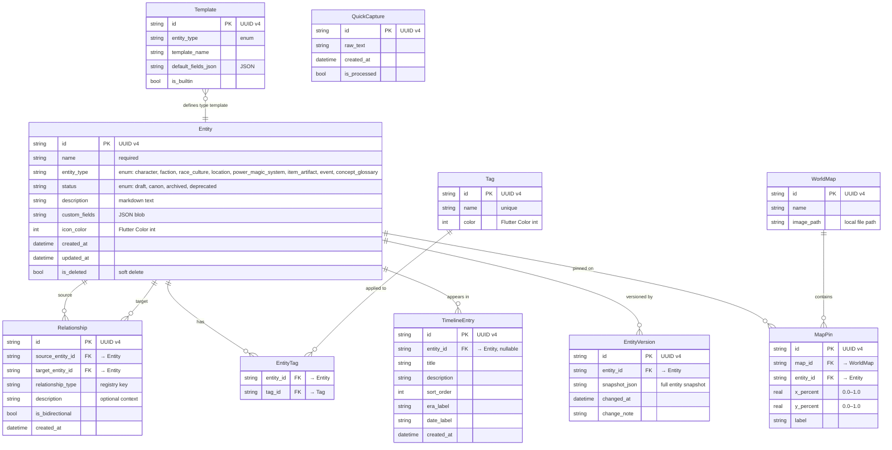
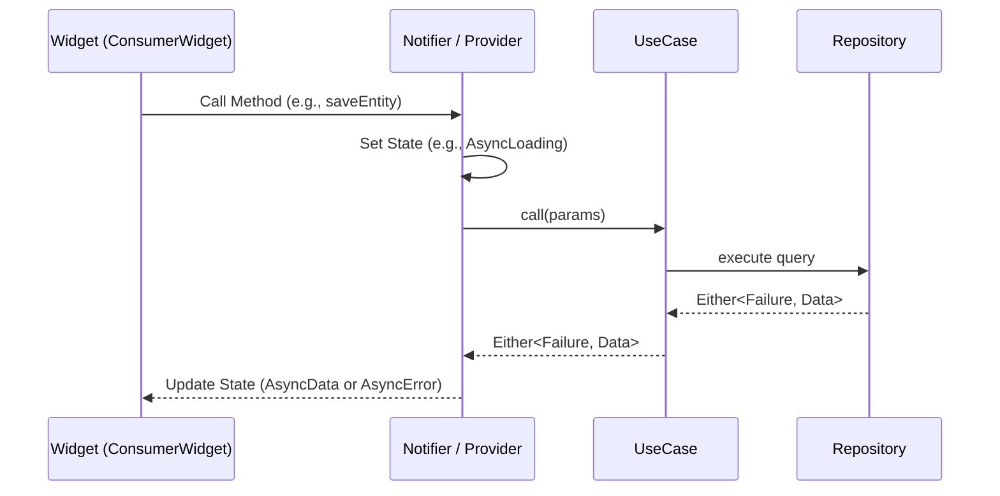
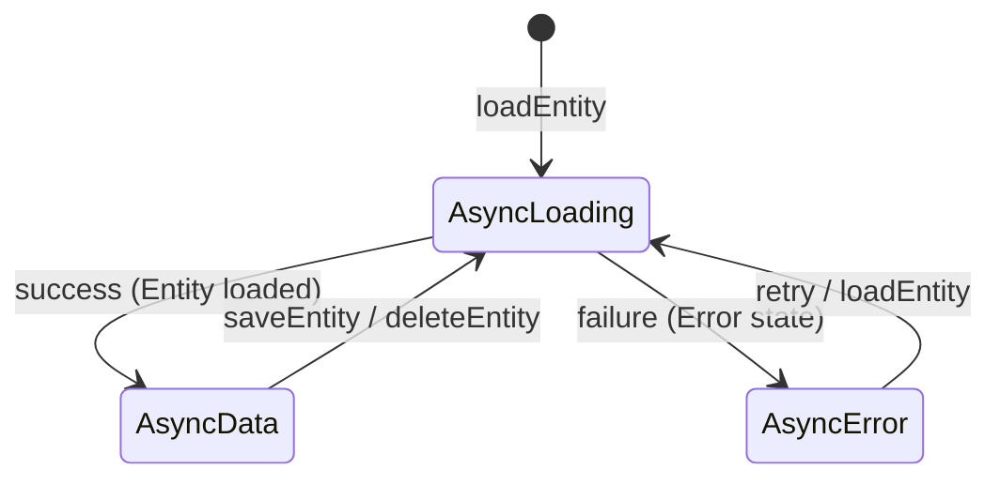
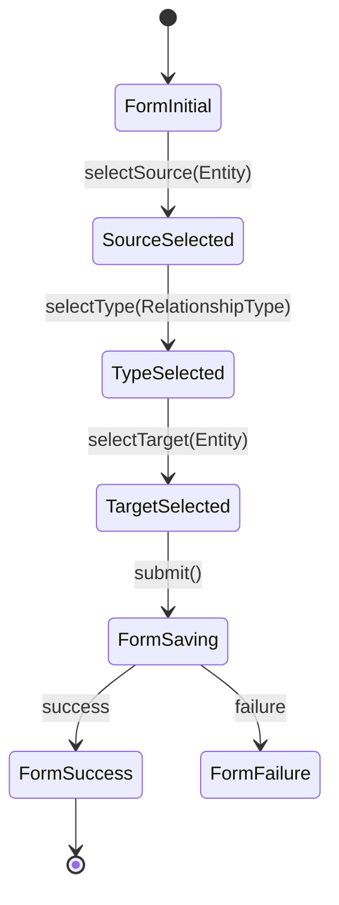

# 03 — System Architecture

> Fictionist uses Clean Architecture with Riverpod state management and Drift (SQLite) for persistence.
> This document is the single source of truth for architectural decisions.

---

## 1. Architecture Overview

Fictionist follows **Clean Architecture** with three concentric layers. Dependencies point inward — outer layers depend on inner layers, never the reverse.

```mermaid
graph TD
    subgraph Presentation["Presentation Layer (Flutter)"]
        direction TB
        W[Widgets / Pages] --> P[Notifier Providers]
        P --> S[State Models (AsyncValue)]
    end

    subgraph Domain["Domain Layer (Pure Dart)"]
        direction TB
        UC[Use Cases] --> RI[Repository Interfaces]
        UC --> E[Entities]
        RI --> E
    end

    subgraph Data["Data Layer"]
        direction TB
        REPO[Repository Implementations] --> DAO[DAOs]
        REPO --> MAP[Mappers]
        DAO --> DB[Drift Database]
        MAP --> E2[Drift Data Classes]
    end

    P --> UC
    REPO -.->|implements| RI

    style Presentation fill:#4A90D9,color:#fff
    style Domain fill:#2ECC71,color:#fff
    style Data fill:#E67E22,color:#fff
```

**Key rules:**

- **Domain** has zero dependencies on Flutter, Drift, or any infrastructure package.
- **Data** implements domain interfaces. The domain never knows the concrete implementation.
- **Presentation** talks to domain exclusively through use cases. Providers/Notifiers never touch repositories directly.
- **Dependency Injection** (get_it + injectable, integrated with Riverpod) wires concrete implementations to abstract interfaces at startup.

---

## 2. Database Decision

### Why Drift?

Fictionist's data model is inherently **relational** — entities link to other entities through typed relationships, tags form many-to-many joins, timeline entries reference entities, and map pins cross-reference both maps and entities. A relational database is the only sane choice.

### Comparison Matrix

| Criteria | **Drift (SQLite)** | Isar | ObjectBox | sqflite | Hive |
|---|---|---|---|---|---|
| **Relational queries** | ✅ Full SQL, JOINs, subqueries | ❌ NoSQL, links only | ❌ NoSQL, relations are objects | ✅ Raw SQL | ❌ Key-value |
| **Type safety** | ✅ Compile-time verified queries | ✅ Generated models | ✅ Generated models | ❌ Raw strings, runtime errors | ❌ Dynamic |
| **Full-text search** | ✅ FTS5 built-in | ✅ Built-in | ⚠️ Limited | ⚠️ Manual FTS setup | ❌ None |
| **Schema migrations** | ✅ Versioned, stepwise, tested | ⚠️ Auto-migration, limited control | ⚠️ Auto-migration | ❌ Manual SQL | ❌ Not applicable |
| **Relationship modeling** | ✅ FKs, JOINs, cascades | ⚠️ Links, no JOINs | ⚠️ ToOne/ToMany, no JOINs | ✅ FKs (manual) | ❌ Manual |
| **Maintenance** | ✅ Active, backed by Simon Binder | ⚠️ Sole maintainer, rewrites | ✅ Funded company | ✅ Stable, minimal | ⚠️ Declining |
| **Community** | ✅ Large, well-documented | ⚠️ Growing | ⚠️ Moderate | ✅ Large | ⚠️ Declining |
| **Offline-first** | ✅ SQLite is local-first by nature | ✅ | ✅ | ✅ | ✅ |

**Decision: Drift.** No contest for a relational domain model. Isar/ObjectBox fight against the grain for FK-heavy schemas. sqflite gives raw SQL without type safety. Hive is for simple key-value caching.

---

## 3. Data Model

### 3.1 ER Diagram



### 3.2 Table Descriptions

#### Entity

The core table. Every worldbuilding element — characters, factions, locations, magic systems — is an `Entity` row. The `entity_type` enum determines which UI template and custom field schema applies. Soft-deleted via `is_deleted` to support undo and future sync conflict resolution.

#### Relationship

Directed edges between two entities. `source_entity_id` → `target_entity_id`. The `relationship_type` field references a key in the **relationship type registry** (see §4). When `is_bidirectional` is true, queries resolve the edge in both directions without duplicating rows.

#### Tag / EntityTag

Classic many-to-many tagging. Tags have a user-chosen color for visual grouping. `EntityTag` is the join table — composite PK of `(entity_id, tag_id)`.

#### TimelineEntry

Ordered events on a fictional timeline. `entity_id` is nullable because some timeline entries are standalone world events not tied to a specific entity. `sort_order` is an integer for drag-and-drop reordering. `era_label` and `date_label` are freeform strings — fictional worlds don't use real calendars.

#### EntityVersion

Append-only version history. Each row captures a full JSON snapshot of the entity at a point in time. Used for undo, diff display, and audit trail. `change_note` is optional — populated when the user explicitly saves with a message.

#### Template

Pre-configured field schemas for each entity type. `is_builtin` marks system-provided templates (e.g., "Standard Character") that cannot be deleted. `default_fields_json` is a JSON array of custom field definitions that get cloned into a new entity's `custom_fields` on creation.

#### QuickCapture

Inbox for raw ideas. Users jot text quickly; later they process captures into proper entities. `is_processed` tracks whether the capture has been converted.

#### WorldMap / MapPin

`WorldMap` stores metadata and a local file path to the map image. `MapPin` places entities on maps using percentage-based coordinates (responsive to any display size). Each pin links to exactly one entity and one map.

---

## 4. Custom Fields

### JSON Structure

Each entity's `custom_fields` column stores a JSON array:

```json
[
  {
    "key": "age",
    "label": "Age",
    "field_type": "number",
    "value": 34,
    "options": null
  },
  {
    "key": "affiliation",
    "label": "Affiliation",
    "field_type": "select",
    "value": "rebels",
    "options": ["empire", "rebels", "neutral"]
  },
  {
    "key": "backstory",
    "label": "Backstory",
    "field_type": "long_text",
    "value": "Born in the outer rim...",
    "options": null
  }
]
```

### Supported Field Types

| `field_type` | Dart type | Widget |
|---|---|---|
| `text` | `String` | `TextField` |
| `long_text` | `String` | Multi-line `TextField` |
| `number` | `num` | `TextField` with number keyboard |
| `toggle` | `bool` | `Switch` |
| `select` | `String` | `DropdownButton` |
| `multi_select` | `List<String>` | Chip selector |
| `date` | `String` (ISO 8601) | `DatePicker` |
| `link` | `String` (entity UUID) | Entity search/picker |

### Tradeoff: Flexibility vs Queryability

Storing custom fields as JSON sacrifices direct SQL filtering. This is an intentional tradeoff:

- **Flexibility wins**: Writers add/remove/rename fields constantly. A rigid column-per-field schema would require migrations for every custom field change.
- **Queryability mitigation**: Drift supports `json_extract()` via SQLite's JSON1 extension. For FTS, entity `name` and `description` are indexed directly — custom field values are included in the FTS index via a computed column or trigger.
- **If this becomes a bottleneck**: Extract frequently-filtered fields into a `custom_field_index` table with `(entity_id, key, value_text, value_num)` columns. This is a data-layer concern and doesn't affect domain or presentation.

---

## 5. Relationship Type Registry

Relationship types are **not** free-text. They come from a predefined registry that provides metadata for UI rendering and validation.

```dart
class RelationshipTypeDef {
  final String key;            // 'member_of', 'located_in', 'created_by', etc.
  final String label;          // 'Member of'
  final String inverseLabel;   // 'Has member'
  final Set<EntityType> applicableSourceTypes;
  final Set<EntityType> applicableTargetTypes;
  final bool isBidirectional;
}
```

### Predefined Types

| Key | Label | Inverse Label | Bidirectional | Example |
|---|---|---|---|---|
| `member_of` | Member of | Has member | No | Character → Faction |
| `located_in` | Located in | Contains | No | Character → Location |
| `created_by` | Created by | Created | No | Item → Character |
| `allied_with` | Allied with | Allied with | Yes | Faction ↔ Faction |
| `enemy_of` | Enemy of | Enemy of | Yes | Character ↔ Character |
| `parent_of` | Parent of | Child of | No | Character → Character |
| `sibling_of` | Sibling of | Sibling of | Yes | Character ↔ Character |
| `rules` | Rules | Ruled by | No | Character → Location |
| `contains` | Contains | Part of | No | Location → Location |
| `wields` | Wields | Wielded by | No | Character → Item |
| `grants` | Grants | Granted by | No | Power → Character |
| `occurred_at` | Occurred at | Site of | No | Event → Location |
| `participated_in` | Participated in | Involved | No | Character → Event |
| `related_to` | Related to | Related to | Yes | Any ↔ Any |

The registry lives in the **domain layer** as a constant list. The UI reads it to populate dropdowns filtered by source/target entity types. Users can still add custom types via a `custom` key with freeform labels — the registry is the default set, not a hard constraint.

---

## 6. App Architecture Layers — Detail

### 6.1 Data Layer

```
data/
├── database/
│   ├── app_database.dart        # Drift database class, table definitions
│   ├── app_database.g.dart      # Generated
│   └── tables/                  # One file per Drift table class
├── dao/
│   ├── entity_dao.dart          # EntityDao extends DatabaseAccessor
│   ├── relationship_dao.dart
│   ├── tag_dao.dart
│   ├── timeline_dao.dart
│   ├── template_dao.dart
│   ├── quick_capture_dao.dart
│   └── map_dao.dart
├── mapper/
│   ├── entity_mapper.dart       # Drift row ↔ Domain entity
│   ├── relationship_mapper.dart
│   └── ...
└── repository/
    ├── entity_repository_impl.dart
    ├── relationship_repository_impl.dart
    └── ...
```

**Key conventions:**

- **DAOs** handle raw Drift queries. One DAO per aggregate root. They return Drift-generated data classes.
- **Mappers** convert between Drift data classes and domain entities. Pure functions, no dependencies.
- **Repository implementations** implement domain interfaces. They compose DAOs + Mappers. All error handling (try/catch → `Either<Failure, T>`) happens here.

### 6.2 Domain Layer

```
domain/
├── entity/
│   ├── entity.dart              # Immutable domain entity (freezed)
│   ├── entity_type.dart         # Enum
│   ├── entity_status.dart       # Enum
│   └── custom_field.dart        # Custom field value object
├── relationship/
│   ├── relationship.dart
│   └── relationship_type_registry.dart
├── tag/
│   └── tag.dart
├── timeline/
│   └── timeline_entry.dart
├── template/
│   └── template.dart
├── repository/
│   ├── entity_repository.dart   # Abstract interface
│   ├── relationship_repository.dart
│   └── ...
├── use_case/
│   ├── entity/
│   │   ├── create_entity_use_case.dart
│   │   ├── get_entity_use_case.dart
│   │   ├── update_entity_use_case.dart
│   │   ├── delete_entity_use_case.dart
│   │   ├── search_entities_use_case.dart
│   │   └── list_entities_use_case.dart
│   ├── relationship/
│   │   ├── create_relationship_use_case.dart
│   │   └── get_entity_relationships_use_case.dart
│   └── ...
└── failure/
    └── failure.dart             # Failure sealed class hierarchy
```

**Key conventions:**

- **Entities** are immutable value objects. Use `freezed` for `copyWith`, equality, and serialization.
- **Use cases** are single-responsibility classes with a `call()` method. They orchestrate repository calls and business rules.
- **Repository interfaces** are abstract classes. No implementation details leak.
- **Zero Flutter imports** in this entire layer.

### 6.3 Presentation Layer

```
presentation/
├── entity/
│   ├── provider/
│   │   ├── entity_list_provider.dart    # Riverpod notifier (holds list state)
│   │   ├── entity_detail_provider.dart  # Riverpod notifier (holds async detail state)
│   │   └── entity_search_provider.dart  # Riverpod notifier (holds search state)
│   ├── page/
│   │   ├── entity_list_page.dart
│   │   └── entity_detail_page.dart
│   └── widget/
│       ├── entity_card.dart
│       ├── entity_form.dart
│       └── custom_field_renderer.dart
├── relationship/
│   ├── provider/
│   │   └── relationship_provider.dart   # Riverpod notifier for relationships
│   ├── page/
│   └── widget/
├── common/
│   ├── widget/
│   │   ├── app_scaffold.dart
│   │   ├── search_bar.dart
│   │   └── empty_state.dart
│   └── theme/
│       └── app_theme.dart
└── router/
    └── app_router.dart          # go_router config
```

---

## 7. State Management

### 7.1 Riverpod Pattern

Every feature gets a code-generated notifier (typically subclassing `Notifier` or `AsyncNotifier`). Widgets access state reactively using `ref.watch()` and trigger business logic via notifier methods.



### 7.2 Riverpod Provider Types

| Provider Type | Use Case | Lifecycle |
|---|---|---|
| `Provider` | Injecting read-only dependencies (e.g., use cases, repositories) | Singleton / Auto-dispose |
| `NotifierProvider` | Synchronous state that can change (e.g., UI filters, active tab) | Auto-dispose by default |
| `AsyncNotifierProvider` | Asynchronous state loaded from database, featuring built-in loading/error states (`AsyncValue`) | Auto-dispose by default |
| `FutureProvider` / `StreamProvider` | Direct read-only asynchronous data streams from database (Drift queries) | Auto-dispose by default |

### 7.3 Entity Editing Flow

Entity editing is handled by an `AutoDisposeAsyncNotifier<Entity>` which manages the lifecycle of fetching, editing, saving, and deleting an entity.



**State Representation:**
Instead of manual events and states, we leverage Riverpod's built-in `AsyncValue<T>`:
- **Loading:** `AsyncLoading<Entity>()` — rendered as a loading spinner.
- **Success:** `AsyncData<Entity>(entity)` — displays form/detail view.
- **Error:** `AsyncError<Entity>(failure, stackTrace)` — displays error banner.

**Notifier Actions (Methods):**
- `Future<void> fetchEntity(String id)`
- `Future<void> saveEntity(EntityFormData data)`
- `Future<void> deleteEntity()`
- `void updateField(String key, dynamic value)` (updates local state copy before saving)

### 7.4 Relationship Creation Flow

Managed by a dedicated `RelationshipFormNotifier` holding a custom `RelationshipFormState` model.



The UI utilizes Riverpod's dependency tracking to filter candidates:
1. `sourceEntity` is selected.
2. `applicableRelationshipTypesProvider` (a provider that depends on `sourceEntity`) updates to filter relationship types.
3. `targetCandidatesProvider` (depends on `sourceEntity` and selected type) updates to filter potential target entities.

---

## 8. Backup & Export Strategy

### 8.1 JSON Export

The app exports the entire database as a single JSON file:

```json
{
  "fictionist_version": "1.0.0",
  "export_format_version": 1,
  "exported_at": "2026-07-05T13:13:00Z",
  "data": {
    "entities": [...],
    "relationships": [...],
    "tags": [...],
    "entity_tags": [...],
    "timeline_entries": [...],
    "entity_versions": [...],
    "templates": [...],
    "quick_captures": [...],
    "world_maps": [...],
    "map_pins": [...]
  }
}
```

### 8.2 Format Versioning

- `export_format_version` is an integer that increments on breaking schema changes.
- The import flow reads `export_format_version` first and applies migration transforms if the format is older than the app's current version.
- Map images are exported as base64-encoded strings within the `world_maps` entries, or as a companion ZIP when the export size exceeds a threshold.

### 8.3 Import Behavior

- **Merge vs Replace**: The user chooses. Replace wipes the local DB. Merge uses UUID-based deduplication — matching UUIDs update the local row if the import's `updated_at` is newer.
- **Conflict resolution on merge**: Last-write-wins based on `updated_at`. No interactive conflict resolution in v1.

---

## 9. Future Sync Architecture

Fictionist is offline-first today, but the architecture is designed to support cloud sync later without rewrites.

### 9.1 Why It's Ready

| Concern | Current design choice | Sync implication |
|---|---|---|
| **IDs** | UUID v4 everywhere | No server-assigned ID conflicts |
| **Soft deletes** | `is_deleted` flag | Tombstones propagate to other devices |
| **Timestamps** | `created_at`, `updated_at` on all mutable tables | Last-write-wins conflict resolution |
| **Repository pattern** | Domain depends on abstract interfaces | Swap `DriftEntityRepository` for `SyncedEntityRepository` without touching domain or presentation |
| **Version history** | `EntityVersion` table | Full audit trail for three-way merge |

### 9.2 What Sync Would Add

- **Dirty flag**: Add `is_dirty` column to all synced tables. Set on local write, clear on successful push.
- **Sync queue**: A `SyncQueue` table tracking pending operations (`create`, `update`, `delete`) with retry counts.
- **Remote data source**: A new `RemoteDataSource` interface in the data layer, implemented against Firebase/Supabase/custom API.
- **Sync repository**: A new repository implementation that composes `LocalDataSource` + `RemoteDataSource`, handles conflict resolution, and manages the sync queue.
- **Background sync**: Using `workmanager` or isolates for periodic push/pull.

### 9.3 Sync Will NOT Require

- Changes to domain entities or use cases.
- Changes to Riverpod providers or presentation logic.
- Changes to the Drift schema (only additions: `is_dirty`, `SyncQueue`).
- Migration of existing user data — UUIDs and timestamps are already in place.

---

## References

- [Repository Structure](file:///D:/Fictionist/docs/04-repository-structure.md)
- [Coding Standards](file:///D:/Fictionist/docs/05-coding-standard.md)
- [Drift Documentation](https://drift.simonbinder.eu/)
- [Riverpod Documentation](https://riverpod.dev/)
- [Clean Architecture (Uncle Bob)](https://blog.cleancoder.com/uncle-bob/2012/08/13/the-clean-architecture.html)
