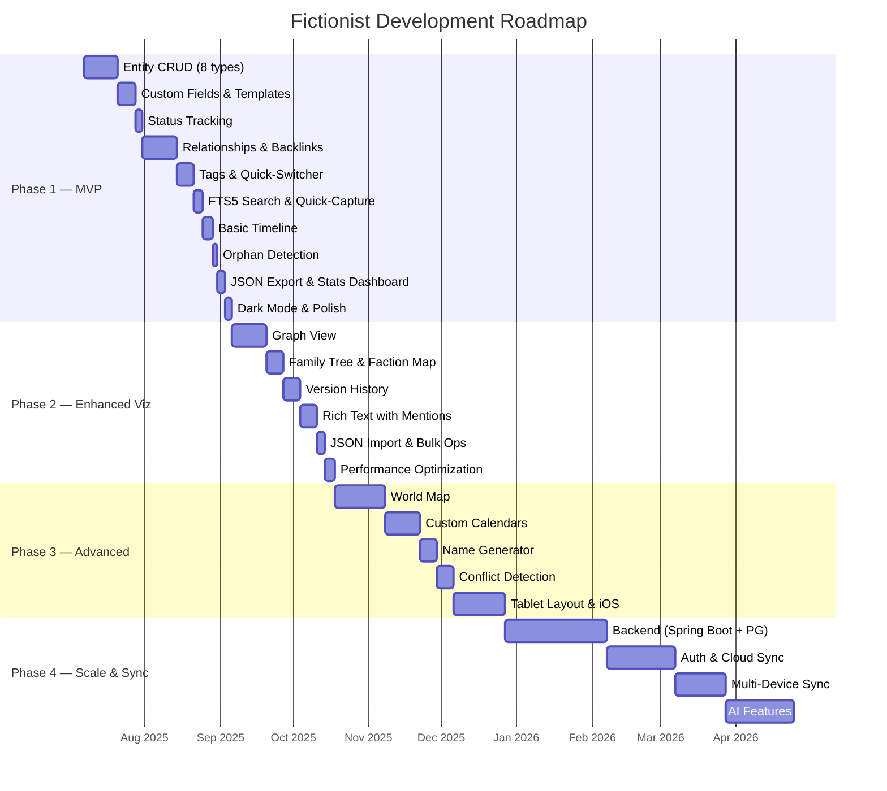

# 08 — Roadmap

Phased development plan for Fictionist. Each phase is a self-contained milestone with clear deliverables and exit criteria. No phase starts until the previous phase's go/no-go criteria are met.

---

## Gantt Chart



---

## Phase 1 — MVP (V1.0)

**Goal:** A fully functional offline worldbuilding tool that a novelist can actually use daily.

**Effort:** 6–8 weeks

### Key Deliverables

| Feature | Description | Effort |
|---|---|---|
| Entity CRUD | Full create/read/update/delete for all 8 entity types: Character, Location, Event, Item, Faction, Lore, Scene, Note | 2 weeks |
| Custom Fields | User-defined fields per entity type. Field types: text, number, date, select, multi-select, toggle | 1 week |
| Templates | Pre-built and user-created entity templates with default fields | Bundled with custom fields |
| Status Tracking | Configurable status workflow per entity type (Draft → In Progress → Complete) | 3 days |
| Typed Relationships | Directional relationships with type labels. Auto-generated reciprocals (e.g., "parent of" ↔ "child of") | 2 weeks |
| Backlinks | Every entity shows incoming references. Tap to navigate. | Bundled with relationships |
| Tags | Free-form tagging system. Filter entities by tag. | 3 days |
| Quick-Switcher | `Cmd+K` style overlay. Fuzzy search across all entities by name. | 4 days |
| FTS5 Search | Full-text search across entity names, descriptions, and custom field values using SQLite FTS5 | 4 days |
| Quick-Capture | Floating action button to create any entity type with minimal friction. Name + type, save, edit later. | 2 days |
| Basic Timeline | Chronological view of Events. Manual ordering. No custom calendar yet. | 4 days |
| Orphan Detection | Surface entities with zero relationships. Nudge the user to connect them. | 2 days |
| JSON Export | Export full world state as structured JSON. One file, all entities and relationships. | 2 days |
| Stats Dashboard | Entity counts by type, relationship density, recently modified, orphan count | 1 day |
| Dark Mode | System-aware theme switching. Dark as default. | 3 days |

### Dependencies

- None. This is the foundation. All infrastructure (Drift DB, Riverpod, DI, routing) is built here.

### Go/No-Go Criteria for Phase 2

```
[✓] All 8 entity types with full CRUD working
[✓] Relationships render correctly with reciprocals
[✓] FTS5 search returns results across all entity fields
[✓] JSON export produces valid, re-importable structure
[✓] All unit and widget tests pass
[✓] App runs stable on physical device for 30+ minutes without crash
[✓] Developer has used the app to build a real test world (50+ entities)
```

---

## Phase 2 — Enhanced Visualization (V1.x)

**Goal:** Make the world explorable. Let the user *see* their world, not just list it.

**Effort:** 4–6 weeks

### Key Deliverables

| Feature | Description | Effort |
|---|---|---|
| Graph View | [✓] Interactive node-link diagram of entities and relationships. Tap node to navigate. Zoom/pan. | 2 weeks |
| Family Tree | [✓] Hierarchical tree view for Character entities with parent/child/sibling relationships | 1 week |
| Faction Map | [✓] Network visualization of faction membership and alliances | Bundled with graph view |
| Version History | [✓] Track changes per entity. View diffs. Restore previous versions. Stored in Drift. | 1 week |
| Rich Text | [✓] Replace plain text descriptions with a rich text editor. Support `@mentions` that link to other entities. | 1 week |
| JSON Import | [✓] Import a previously exported JSON file. Merge or replace. Conflict resolution UI. | 3 days |
| Bulk Operations | [✓] Multi-select entities. Batch tag, batch delete, batch status change. | 3 days |
| Performance Optimization | [✓] Profile and fix jank. Lazy loading for large worlds. Pagination for entity lists. Index tuning. | 4 days |

### Dependencies

- Phase 1 complete and stable
- Relationship data model must support the graph/tree renderers
- Version history requires a schema migration (add `entity_versions` table)

### Go/No-Go Criteria for Phase 3

```
[✓] Graph view renders 200+ entities without jank (<16ms frames)
[✓] Version history correctly tracks and restores entity state
[✓] JSON import round-trips cleanly (export → import → export = identical)
[✓] Rich text mentions resolve to correct entities
[✓] No regressions in Phase 1 features (full test suite green)
```

---

## Phase 3 — Advanced Features (V2.0)

**Goal:** Differentiate from competitors. Add features that make Fictionist the best-in-class worldbuilding tool.

**Effort:** 10–12 weeks

### Key Deliverables

| Feature | Description | Effort |
|---|---|---|
| World Map | [✓] Interactive 2D canvas. Pin entities to locations on a user-uploaded image. Zoom/pan, tap to navigate. | 3 weeks |
| Custom Calendars | Define fictional calendar systems (custom months, days, epochs). Timeline uses the custom calendar. | 2 weeks |
| Name Generator | [✓] Configurable name generation by culture/phoneme pattern. Markov chain or rule-based. | 1 week |
| Conflict Detection | [✓] Flag logical inconsistencies: dead characters attending events, circular timelines, contradictory relationships | 1 week |
| Tablet Layout | Responsive layout with master-detail pane. Side-by-side entity editing. | 2 weeks |
| iOS Support | Build, test, and polish for iOS. Handle platform differences (file paths, permissions, UI conventions). | 3 weeks |

### Dependencies

- Phase 2 graph renderer provides foundation for world map
- Custom calendars require timeline refactor from Phase 1
- iOS requires macOS dev environment, Apple Developer account ($99/yr)

### Go/No-Go Criteria for Phase 4

```
[✓] World map supports 50+ pins without performance degradation
[✓] Custom calendar correctly computes date arithmetic
[✓] Conflict detection surfaces real issues (tested against intentionally broken world)
[✓] App runs on both Android and iOS with no platform-specific crashes
[✓] Tablet layout tested on 10" screen
[✓] User feedback collected from at least 5 beta testers
```

---

## Phase 4 — Scale & Sync (V3.0)

**Goal:** Go multi-device and online. This is a major architecture shift.

**Effort:** 17+ weeks

### Key Deliverables

| Feature | Description | Effort |
|---|---|---|
| Backend API | Spring Boot + PostgreSQL. RESTful API for all entity operations. Mirrors the Drift schema. | 6 weeks |
| Authentication | Email/password + OAuth (Google). JWT-based session management. | 2 weeks |
| Cloud Sync | Bidirectional sync between local Drift DB and remote PostgreSQL. Conflict resolution with last-write-wins + manual merge. | 4 weeks |
| Multi-Device | Same world accessible from multiple devices. Real-time sync via WebSocket or polling. | 3 weeks |
| AI Features | AI-powered suggestions: character name ideas, plot hole detection, relationship suggestions. On-device or API-based. | 4 weeks |

> [!WARNING]
> Phase 4 fundamentally changes the app's architecture. The offline-first local DB becomes the sync client, not the source of truth. Plan the sync protocol carefully — this is where most apps fail.

### Dependencies

- All previous phases stable
- Backend infrastructure (server, domain, SSL)
- Spring Boot + PostgreSQL expertise (developer has this from fullstack background)
- AI features may require API keys (OpenAI, Gemini) or on-device model integration

### Go/No-Go Criteria for Launch

```
[✓] Sync handles offline edits on two devices editing the same entity
[✓] No data loss under any tested scenario (airplane mode, force kill, mid-sync crash)
[✓] Auth flow tested with real accounts
[✓] API response times <200ms p95 for all CRUD operations
[✓] Backend deployed and load-tested for 100 concurrent users
[✓] AI features have clear value (validated with beta testers)
```

---

## Phase Summary

| Phase | Version | Effort | Key Risk | Exit Criterion |
|---|---|---|---|---|
| 1 — MVP | V1.0 | 6–8 weeks | Scope creep on entity model | Usable for real worldbuilding |
| 2 — Enhanced Viz | V1.x | 4–6 weeks | Graph performance at scale | 200+ entities render smoothly |
| 3 — Advanced | V2.0 | 10–12 weeks | Custom calendar complexity | Cross-platform stable |
| 4 — Scale & Sync | V3.0 | 17+ weeks | Sync conflict resolution | Zero data loss under all scenarios |

> [!IMPORTANT]
> **Ship Phase 1 first. Use it. Get feedback. Then decide if Phase 2's priorities are right.** Roadmaps are hypotheses, not commitments. The Gantt chart shows sequencing, not deadlines.

---

## What's Explicitly Deferred

These are **not** on the roadmap. Mentioning them to prevent scope creep.

- **Web app** — Flutter web exists but offline-first + Drift doesn't translate well. Not worth it.
- **Desktop app** — Possible with Flutter, but no user demand signal yet.
- **Collaboration / multiplayer** — Requires real-time sync, permissions, presence. Phase 5 at earliest.
- **Plugin system** — Interesting but premature. Stabilize the core first.
- **Monetization** — No business model decisions until Phase 3. Build something worth paying for first.
